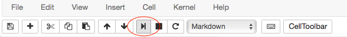
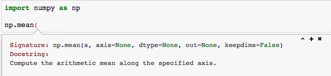
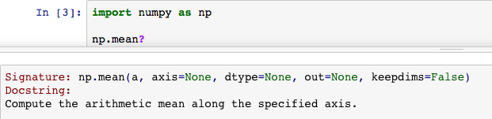

Este breve tutorial explica alguna de las herramientas básicas de Ciencia de Datos disponibles en Python

# ¿Qué es Python?

- Python es un lenguaje de programación interpretado.
- Su nombre proviene de la afición de su creador original, [Guido van Rossum](https://es.wikipedia.org/wiki/Guido_van_Rossum), por los humoristas británicos [Monty Python](https://es.wikipedia.org/wiki/Monty_Python).
- Características:
  - Programación orientada a objetos
  - Programación imperativa
  - Programación funcional.
  - Es multiplataforma y posee una licencia abierta.

Para una introducción a Python, consulta el [taller de Python impartido en el ASL](https://aulasoftwarelibre.github.io/taller-de-python/)

# Entornos de desarrollo para Python

- Entornos de desarrollo para Python
  - [PyCharm](https://www.jetbrains.com/pycharm/)
  - [Spyder](https://github.com/spyder-ide/spyder)
  - [Visual Studio Code](https://code.visualstudio.com/)

Jupyter Notebooks (libros de notas o cuadernos Jupyter)
==================

* Puedes ejecutar un `Cell` (celda) pulsando ``[shift] + [Enter]`` o presionando el botón `Play` en la barra de herramientas.



* Puedes obtener ayuda sobre una función u objeto presionando ``[shift] + [tab]`` después de los paréntesis de apertura ``function(``



* También puedes obtener la ayuda ejecutando ``function?``



# [NumPy](https://numpy.org/)

Librería de cálculo numérico para Python.
- Escrita en C: operaciones muy rápidas
- Permite trabajar con arrays n-dimensionales (vectores, matrices, etc.)
- Contiene un amplio catálogo de operaciones numércias: creación de matrices, operaciones vectoriales, *slicing*, cálculo matricial, polinomios, tratamiento de señales...

**Todas** las librerías de cálculo científico del ecosistema de Python se basan en NumPy.

# [`pandas`](https://pandas.pydata.org/)

Herramienta de análisis de datos muy flexible construída sobre NumPy.

Nos permite trabajar sobre "DataFrames" (datos tabulados) con indices de tipo arbitrario (pueden ser numéricos, etiquetas, fechas...)


Incluye herramientas para cargar/guardar datos en distintos formatos (CSV, Calc/Excel, JSON...)

### Carga de datos

El método `read_csv()` de `pandas` permite dos modos de trabajo: que el propio fichero CSV tenga una fila con los nombres de las variables o que nosotros especifiquemos los nombres de las variables en la llamada. En este caso, vamos a utilizar la segunda aproximación. De esta forma, creamos un array con los nombres de las variables:


```python
import pandas as pd

nombre_variables = ['longitud_sepalo', 'ancho_sepalo', 'longitud_petalo', 'ancho_petalo', 'clase']
# Carga de datos desde la web: descarga el CSV y lo carga como DataFrame
iris = pd.read_csv('https://raw.githubusercontent.com/ayrna/tutorial-scikit-learn-IMC/master/data/iris.csv',
                   names = nombre_variables)
iris
```


<div>
<style scoped>
    .dataframe tbody tr th:only-of-type {
        vertical-align: middle;
    }

    .dataframe tbody tr th {
        vertical-align: top;
    }

    .dataframe thead th {
        text-align: right;
    }
</style>
<table border="1" class="dataframe">
  <thead>
    <tr style="text-align: right;">
      <th></th>
      <th>longitud_sepalo</th>
      <th>ancho_sepalo</th>
      <th>longitud_petalo</th>
      <th>ancho_petalo</th>
      <th>clase</th>
    </tr>
  </thead>
  <tbody>
    <tr>
      <th>0</th>
      <td>5.1</td>
      <td>3.5</td>
      <td>1.4</td>
      <td>0.2</td>
      <td>Iris-setosa</td>
    </tr>
    <tr>
      <th>1</th>
      <td>4.9</td>
      <td>3.0</td>
      <td>1.4</td>
      <td>0.2</td>
      <td>Iris-setosa</td>
    </tr>
    <tr>
      <th>2</th>
      <td>4.7</td>
      <td>3.2</td>
      <td>1.3</td>
      <td>0.2</td>
      <td>Iris-setosa</td>
    </tr>
    <tr>
      <th>3</th>
      <td>4.6</td>
      <td>3.1</td>
      <td>1.5</td>
      <td>0.2</td>
      <td>Iris-setosa</td>
    </tr>
    <tr>
      <th>4</th>
      <td>5.0</td>
      <td>3.6</td>
      <td>1.4</td>
      <td>0.2</td>
      <td>Iris-setosa</td>
    </tr>
    <tr>
      <th>...</th>
      <td>...</td>
      <td>...</td>
      <td>...</td>
      <td>...</td>
      <td>...</td>
    </tr>
    <tr>
      <th>145</th>
      <td>6.7</td>
      <td>3.0</td>
      <td>5.2</td>
      <td>2.3</td>
      <td>Iris-virginica</td>
    </tr>
    <tr>
      <th>146</th>
      <td>6.3</td>
      <td>2.5</td>
      <td>5.0</td>
      <td>1.9</td>
      <td>Iris-virginica</td>
    </tr>
    <tr>
      <th>147</th>
      <td>6.5</td>
      <td>3.0</td>
      <td>5.2</td>
      <td>2.0</td>
      <td>Iris-virginica</td>
    </tr>
    <tr>
      <th>148</th>
      <td>6.2</td>
      <td>3.4</td>
      <td>5.4</td>
      <td>2.3</td>
      <td>Iris-virginica</td>
    </tr>
    <tr>
      <th>149</th>
      <td>5.9</td>
      <td>3.0</td>
      <td>5.1</td>
      <td>1.8</td>
      <td>Iris-virginica</td>
    </tr>
  </tbody>
</table>
<p>150 rows × 5 columns</p>
</div>


Se trata del dataset ["iris"](https://es.wikipedia.org/wiki/Conjunto_de_datos_flor_iris), un ejemplo típico en *machine learning*.  En esta base de datos hay tres clases a predecir, que son tres especies distintas del género *Iris*, de manera que, para cada flor, se extraen cuatro medidas o variables de entrada (longitud y ancho de los pétalos y los sépalos, en cm). Las tres especies a distinguir son *Iris setosa*, *Iris virginica* e *Iris versicolor*.

Este dataset fue obtenido por el botanista Edgar Anderson y utilizado y popularizado por el biólogo y estadista Ronald Fisher en su artículo de 1936 "*The use of multiple measurements in taxonomic problems*" ("El uso de varias mediciones en problemas de taxonomía").

<figure>

    <figcaption>Imagen extraída de <a href="https://www.datacamp.com/community/tutorials/machine-learning-in-r">Machine Learning in R for beginners</a></figcaption>
</figure>

## Inspección de datos

Antes de nada, es conveniente realizar una pequeña **inspección** de los datos. Si simplemente queremos ver la cabecera del dataset, podemos utilizar el método `head(n)`, que devuelve un DataFrame incluyendo los primeros `n` patrones:


```python
iris.head(9)
```


<div>
<style scoped>
    .dataframe tbody tr th:only-of-type {
        vertical-align: middle;
    }

    .dataframe tbody tr th {
        vertical-align: top;
    }

    .dataframe thead th {
        text-align: right;
    }
</style>
<table border="1" class="dataframe">
  <thead>
    <tr style="text-align: right;">
      <th></th>
      <th>longitud_sepalo</th>
      <th>ancho_sepalo</th>
      <th>longitud_petalo</th>
      <th>ancho_petalo</th>
      <th>clase</th>
    </tr>
  </thead>
  <tbody>
    <tr>
      <th>0</th>
      <td>5.1</td>
      <td>3.5</td>
      <td>1.4</td>
      <td>0.2</td>
      <td>Iris-setosa</td>
    </tr>
    <tr>
      <th>1</th>
      <td>4.9</td>
      <td>3.0</td>
      <td>1.4</td>
      <td>0.2</td>
      <td>Iris-setosa</td>
    </tr>
    <tr>
      <th>2</th>
      <td>4.7</td>
      <td>3.2</td>
      <td>1.3</td>
      <td>0.2</td>
      <td>Iris-setosa</td>
    </tr>
    <tr>
      <th>3</th>
      <td>4.6</td>
      <td>3.1</td>
      <td>1.5</td>
      <td>0.2</td>
      <td>Iris-setosa</td>
    </tr>
    <tr>
      <th>4</th>
      <td>5.0</td>
      <td>3.6</td>
      <td>1.4</td>
      <td>0.2</td>
      <td>Iris-setosa</td>
    </tr>
    <tr>
      <th>5</th>
      <td>5.4</td>
      <td>3.9</td>
      <td>1.7</td>
      <td>0.4</td>
      <td>Iris-setosa</td>
    </tr>
    <tr>
      <th>6</th>
      <td>4.6</td>
      <td>3.4</td>
      <td>1.4</td>
      <td>0.3</td>
      <td>Iris-setosa</td>
    </tr>
    <tr>
      <th>7</th>
      <td>5.0</td>
      <td>3.4</td>
      <td>1.5</td>
      <td>0.2</td>
      <td>Iris-setosa</td>
    </tr>
    <tr>
      <th>8</th>
      <td>4.4</td>
      <td>2.9</td>
      <td>1.4</td>
      <td>0.2</td>
      <td>Iris-setosa</td>
    </tr>
  </tbody>
</table>
</div>


## Manejo de objetos `DataFrame` y matrices numpy (`ndarray`)

Los [`DataFrame`](http://pandas.pydata.org/pandas-docs/stable/generated/pandas.DataFrame.html) son objetos que representan a los *datasets* con los que vamos a operar. Permiten realizar muchas operaciones de forma automática, ayudando a transformar las variables de forma muy cómoda. Internamente, el dataset se guarda en un array bidimensional de `numpy` (clase [`ndarray`](http://docs.scipy.org/doc/numpy/reference/generated/numpy.ndarray.html)).

`pandas` nos da la ventaja de poder utilizar las etiquetas de fila (`index`) y columna (`column`) para seleccionarlas de forma más explícita.

Esto además permite **mezclar tipos de datos** (los array de NumPy deben ser homogéneos) en caso de que lo necesitemos.

Para extraer columnas específicas podemos usar los corchetes `[]`:


```python
iris['ancho_sepalo'] # Las columnas son objetos de tipo "Series"
```


    0      3.5
    1      3.0
    2      3.2
    3      3.1
    4      3.6
          ... 
    145    3.0
    146    2.5
    147    3.0
    148    3.4
    149    3.0
    Name: ancho_sepalo, Length: 150, dtype: float64


```python
iris[['ancho_sepalo', 'longitud_sepalo']] # Podemos extraer varias columnas a la vez
                                          # en formato DataFrame
```


<div>
<style scoped>
    .dataframe tbody tr th:only-of-type {
        vertical-align: middle;
    }

    .dataframe tbody tr th {
        vertical-align: top;
    }

    .dataframe thead th {
        text-align: right;
    }
</style>
<table border="1" class="dataframe">
  <thead>
    <tr style="text-align: right;">
      <th></th>
      <th>ancho_sepalo</th>
      <th>longitud_sepalo</th>
    </tr>
  </thead>
  <tbody>
    <tr>
      <th>0</th>
      <td>3.5</td>
      <td>5.1</td>
    </tr>
    <tr>
      <th>1</th>
      <td>3.0</td>
      <td>4.9</td>
    </tr>
    <tr>
      <th>2</th>
      <td>3.2</td>
      <td>4.7</td>
    </tr>
    <tr>
      <th>3</th>
      <td>3.1</td>
      <td>4.6</td>
    </tr>
    <tr>
      <th>4</th>
      <td>3.6</td>
      <td>5.0</td>
    </tr>
    <tr>
      <th>...</th>
      <td>...</td>
      <td>...</td>
    </tr>
    <tr>
      <th>145</th>
      <td>3.0</td>
      <td>6.7</td>
    </tr>
    <tr>
      <th>146</th>
      <td>2.5</td>
      <td>6.3</td>
    </tr>
    <tr>
      <th>147</th>
      <td>3.0</td>
      <td>6.5</td>
    </tr>
    <tr>
      <th>148</th>
      <td>3.4</td>
      <td>6.2</td>
    </tr>
    <tr>
      <th>149</th>
      <td>3.0</td>
      <td>5.9</td>
    </tr>
  </tbody>
</table>
<p>150 rows × 2 columns</p>
</div>


Para seleccionar filas y columnas específicas de de un [`DataFrame`](http://pandas.pydata.org/pandas-docs/stable/generated/pandas.DataFrame.html) especificando sus etiquetas, utilizamos la propiedad `loc` de la siguiente manera:
- `df.loc[i,j]`: accede al valor de la fila con etiqueta `i` y columna con etiqueta `j`.
- `df.loc[[a, b, c], :]`: devuelve otro `DataFrame` sólo con las filas `a`, `b` y `c`.
- `df.loc[:, [d, e, f]]`: ídem, pero para las columnas.
- `df.loc[[a, b, c], [d, e, f]]`: podemos combinar filas y columnas.

Si, en cambio, queremos utilizar índices enteros lo haríamos usando la propiedad `iloc` de la siguiente manera:
- `df.iloc[i,j]`: accede al valor de la fila `i` columna `j`.
- `df.iloc[i:j,k]`: devuelve otro `DataFrame` con la subtabla correspondiente a las filas desde la `i` hasta la `j-1` y a la columna `k`.
- `df.iloc[i:j,k:l]`: devuelve otro `DataFrame` con la submatriz correspondiente a las filas desde la `i` hasta la `j-1` y a las columnas desde la `k` hasta la `l-1`.
- `df.iloc[i:j,:]`: devuelve otro `DataFrame` con la submatriz correspondiente a las filas desde la `i` hasta la `j-1` y **todas** las columnas.
- `df.iloc[:,i:j]`: devuelve otro `DataFrame` con la submatriz correspondiente a **todas** las filas y a las columnas desde la `k` hasta la `l`.

De esta forma:


```python
iris.loc[7, 'ancho_petalo']
```


    0.2


```python
# Esto seleccionará las filas cuya etiqueta es 1, 10 y 20
# y las columnas cuya etiqueta es 'ancho_petalo', 'longitud_sepalo' o 'clase'
iris.loc[[1, 10, 20], ['ancho_petalo', 'longitud_sepalo', 'clase']]
```


<div>
<style scoped>
    .dataframe tbody tr th:only-of-type {
        vertical-align: middle;
    }

    .dataframe tbody tr th {
        vertical-align: top;
    }

    .dataframe thead th {
        text-align: right;
    }
</style>
<table border="1" class="dataframe">
  <thead>
    <tr style="text-align: right;">
      <th></th>
      <th>ancho_petalo</th>
      <th>longitud_sepalo</th>
      <th>clase</th>
    </tr>
  </thead>
  <tbody>
    <tr>
      <th>1</th>
      <td>0.2</td>
      <td>4.9</td>
      <td>Iris-setosa</td>
    </tr>
    <tr>
      <th>10</th>
      <td>0.2</td>
      <td>5.4</td>
      <td>Iris-setosa</td>
    </tr>
    <tr>
      <th>20</th>
      <td>0.2</td>
      <td>5.4</td>
      <td>Iris-setosa</td>
    </tr>
  </tbody>
</table>
</div>


```python
iris.iloc[10:20, 3:5]
```


<div>
<style scoped>
    .dataframe tbody tr th:only-of-type {
        vertical-align: middle;
    }

    .dataframe tbody tr th {
        vertical-align: top;
    }

    .dataframe thead th {
        text-align: right;
    }
</style>
<table border="1" class="dataframe">
  <thead>
    <tr style="text-align: right;">
      <th></th>
      <th>ancho_petalo</th>
      <th>clase</th>
    </tr>
  </thead>
  <tbody>
    <tr>
      <th>10</th>
      <td>0.2</td>
      <td>Iris-setosa</td>
    </tr>
    <tr>
      <th>11</th>
      <td>0.2</td>
      <td>Iris-setosa</td>
    </tr>
    <tr>
      <th>12</th>
      <td>0.1</td>
      <td>Iris-setosa</td>
    </tr>
    <tr>
      <th>13</th>
      <td>0.1</td>
      <td>Iris-setosa</td>
    </tr>
    <tr>
      <th>14</th>
      <td>0.2</td>
      <td>Iris-setosa</td>
    </tr>
    <tr>
      <th>15</th>
      <td>0.4</td>
      <td>Iris-setosa</td>
    </tr>
    <tr>
      <th>16</th>
      <td>0.4</td>
      <td>Iris-setosa</td>
    </tr>
    <tr>
      <th>17</th>
      <td>0.3</td>
      <td>Iris-setosa</td>
    </tr>
    <tr>
      <th>18</th>
      <td>0.3</td>
      <td>Iris-setosa</td>
    </tr>
    <tr>
      <th>19</th>
      <td>0.3</td>
      <td>Iris-setosa</td>
    </tr>
  </tbody>
</table>
</div>


El acceso a los elementos de un [`DataFrame`](http://pandas.pydata.org/pandas-docs/stable/generated/pandas.DataFrame.html) con `iloc` es similar a obtener su [`ndarray`](http://docs.scipy.org/doc/numpy/reference/generated/numpy.ndarray.html) de NumPy subyacente, con la desventaja de no poder trabajar con datos mixtos (números y cadenas, por ejemplo). Para lo cual simplemente tenemos que utilizar el atributo `values`:


```python
iris.values
```


    array([[5.1, 3.5, 1.4, 0.2, 'Iris-setosa'],
           [4.9, 3.0, 1.4, 0.2, 'Iris-setosa'],
           [4.7, 3.2, 1.3, 0.2, 'Iris-setosa'],
           [4.6, 3.1, 1.5, 0.2, 'Iris-setosa'],
           [5.0, 3.6, 1.4, 0.2, 'Iris-setosa'],
           [5.4, 3.9, 1.7, 0.4, 'Iris-setosa'],
           [4.6, 3.4, 1.4, 0.3, 'Iris-setosa'],
           [5.0, 3.4, 1.5, 0.2, 'Iris-setosa'],
           [4.4, 2.9, 1.4, 0.2, 'Iris-setosa'],
           [4.9, 3.1, 1.5, 0.1, 'Iris-setosa'],
           [5.4, 3.7, 1.5, 0.2, 'Iris-setosa'],
           [4.8, 3.4, 1.6, 0.2, 'Iris-setosa'],
           [4.8, 3.0, 1.4, 0.1, 'Iris-setosa'],
           [4.3, 3.0, 1.1, 0.1, 'Iris-setosa'],
           [5.8, 4.0, 1.2, 0.2, 'Iris-setosa'],
           [5.7, 4.4, 1.5, 0.4, 'Iris-setosa'],
           [5.4, 3.9, 1.3, 0.4, 'Iris-setosa'],
           [5.1, 3.5, 1.4, 0.3, 'Iris-setosa'],
           [5.7, 3.8, 1.7, 0.3, 'Iris-setosa'],
           [5.1, 3.8, 1.5, 0.3, 'Iris-setosa'],
           [5.4, 3.4, 1.7, 0.2, 'Iris-setosa'],
           [5.1, 3.7, 1.5, 0.4, 'Iris-setosa'],
           [4.6, 3.6, 1.0, 0.2, 'Iris-setosa'],
           [5.1, 3.3, 1.7, 0.5, 'Iris-setosa'],
           [4.8, 3.4, 1.9, 0.2, 'Iris-setosa'],
           [5.0, 3.0, 1.6, 0.2, 'Iris-setosa'],
           [5.0, 3.4, 1.6, 0.4, 'Iris-setosa'],
           [5.2, 3.5, 1.5, 0.2, 'Iris-setosa'],
           [5.2, 3.4, 1.4, 0.2, 'Iris-setosa'],
           [4.7, 3.2, 1.6, 0.2, 'Iris-setosa'],
           [4.8, 3.1, 1.6, 0.2, 'Iris-setosa'],
           [5.4, 3.4, 1.5, 0.4, 'Iris-setosa'],
           [5.2, 4.1, 1.5, 0.1, 'Iris-setosa'],
           [5.5, 4.2, 1.4, 0.2, 'Iris-setosa'],
           [4.9, 3.1, 1.5, 0.1, 'Iris-setosa'],
           [5.0, 3.2, 1.2, 0.2, 'Iris-setosa'],
           [5.5, 3.5, 1.3, 0.2, 'Iris-setosa'],
           [4.9, 3.1, 1.5, 0.1, 'Iris-setosa'],
           [4.4, 3.0, 1.3, 0.2, 'Iris-setosa'],
           [5.1, 3.4, 1.5, 0.2, 'Iris-setosa'],
           [5.0, 3.5, 1.3, 0.3, 'Iris-setosa'],
           [4.5, 2.3, 1.3, 0.3, 'Iris-setosa'],
           [4.4, 3.2, 1.3, 0.2, 'Iris-setosa'],
           [5.0, 3.5, 1.6, 0.6, 'Iris-setosa'],
           [5.1, 3.8, 1.9, 0.4, 'Iris-setosa'],
           [4.8, 3.0, 1.4, 0.3, 'Iris-setosa'],
           [5.1, 3.8, 1.6, 0.2, 'Iris-setosa'],
           [4.6, 3.2, 1.4, 0.2, 'Iris-setosa'],
           [5.3, 3.7, 1.5, 0.2, 'Iris-setosa'],
           [5.0, 3.3, 1.4, 0.2, 'Iris-setosa'],
           [7.0, 3.2, 4.7, 1.4, 'Iris-versicolor'],
           [6.4, 3.2, 4.5, 1.5, 'Iris-versicolor'],
           [6.9, 3.1, 4.9, 1.5, 'Iris-versicolor'],
           [5.5, 2.3, 4.0, 1.3, 'Iris-versicolor'],
           [6.5, 2.8, 4.6, 1.5, 'Iris-versicolor'],
           [5.7, 2.8, 4.5, 1.3, 'Iris-versicolor'],
           [6.3, 3.3, 4.7, 1.6, 'Iris-versicolor'],
           [4.9, 2.4, 3.3, 1.0, 'Iris-versicolor'],
           [6.6, 2.9, 4.6, 1.3, 'Iris-versicolor'],
           [5.2, 2.7, 3.9, 1.4, 'Iris-versicolor'],
           [5.0, 2.0, 3.5, 1.0, 'Iris-versicolor'],
           [5.9, 3.0, 4.2, 1.5, 'Iris-versicolor'],
           [6.0, 2.2, 4.0, 1.0, 'Iris-versicolor'],
           [6.1, 2.9, 4.7, 1.4, 'Iris-versicolor'],
           [5.6, 2.9, 3.6, 1.3, 'Iris-versicolor'],
           [6.7, 3.1, 4.4, 1.4, 'Iris-versicolor'],
           [5.6, 3.0, 4.5, 1.5, 'Iris-versicolor'],
           [5.8, 2.7, 4.1, 1.0, 'Iris-versicolor'],
           [6.2, 2.2, 4.5, 1.5, 'Iris-versicolor'],
           [5.6, 2.5, 3.9, 1.1, 'Iris-versicolor'],
           [5.9, 3.2, 4.8, 1.8, 'Iris-versicolor'],
           [6.1, 2.8, 4.0, 1.3, 'Iris-versicolor'],
           [6.3, 2.5, 4.9, 1.5, 'Iris-versicolor'],
           [6.1, 2.8, 4.7, 1.2, 'Iris-versicolor'],
           [6.4, 2.9, 4.3, 1.3, 'Iris-versicolor'],
           [6.6, 3.0, 4.4, 1.4, 'Iris-versicolor'],
           [6.8, 2.8, 4.8, 1.4, 'Iris-versicolor'],
           [6.7, 3.0, 5.0, 1.7, 'Iris-versicolor'],
           [6.0, 2.9, 4.5, 1.5, 'Iris-versicolor'],
           [5.7, 2.6, 3.5, 1.0, 'Iris-versicolor'],
           [5.5, 2.4, 3.8, 1.1, 'Iris-versicolor'],
           [5.5, 2.4, 3.7, 1.0, 'Iris-versicolor'],
           [5.8, 2.7, 3.9, 1.2, 'Iris-versicolor'],
           [6.0, 2.7, 5.1, 1.6, 'Iris-versicolor'],
           [5.4, 3.0, 4.5, 1.5, 'Iris-versicolor'],
           [6.0, 3.4, 4.5, 1.6, 'Iris-versicolor'],
           [6.7, 3.1, 4.7, 1.5, 'Iris-versicolor'],
           [6.3, 2.3, 4.4, 1.3, 'Iris-versicolor'],
           [5.6, 3.0, 4.1, 1.3, 'Iris-versicolor'],
           [5.5, 2.5, 4.0, 1.3, 'Iris-versicolor'],
           [5.5, 2.6, 4.4, 1.2, 'Iris-versicolor'],
           [6.1, 3.0, 4.6, 1.4, 'Iris-versicolor'],
           [5.8, 2.6, 4.0, 1.2, 'Iris-versicolor'],
           [5.0, 2.3, 3.3, 1.0, 'Iris-versicolor'],
           [5.6, 2.7, 4.2, 1.3, 'Iris-versicolor'],
           [5.7, 3.0, 4.2, 1.2, 'Iris-versicolor'],
           [5.7, 2.9, 4.2, 1.3, 'Iris-versicolor'],
           [6.2, 2.9, 4.3, 1.3, 'Iris-versicolor'],
           [5.1, 2.5, 3.0, 1.1, 'Iris-versicolor'],
           [5.7, 2.8, 4.1, 1.3, 'Iris-versicolor'],
           [6.3, 3.3, 6.0, 2.5, 'Iris-virginica'],
           [5.8, 2.7, 5.1, 1.9, 'Iris-virginica'],
           [7.1, 3.0, 5.9, 2.1, 'Iris-virginica'],
           [6.3, 2.9, 5.6, 1.8, 'Iris-virginica'],
           [6.5, 3.0, 5.8, 2.2, 'Iris-virginica'],
           [7.6, 3.0, 6.6, 2.1, 'Iris-virginica'],
           [4.9, 2.5, 4.5, 1.7, 'Iris-virginica'],
           [7.3, 2.9, 6.3, 1.8, 'Iris-virginica'],
           [6.7, 2.5, 5.8, 1.8, 'Iris-virginica'],
           [7.2, 3.6, 6.1, 2.5, 'Iris-virginica'],
           [6.5, 3.2, 5.1, 2.0, 'Iris-virginica'],
           [6.4, 2.7, 5.3, 1.9, 'Iris-virginica'],
           [6.8, 3.0, 5.5, 2.1, 'Iris-virginica'],
           [5.7, 2.5, 5.0, 2.0, 'Iris-virginica'],
           [5.8, 2.8, 5.1, 2.4, 'Iris-virginica'],
           [6.4, 3.2, 5.3, 2.3, 'Iris-virginica'],
           [6.5, 3.0, 5.5, 1.8, 'Iris-virginica'],
           [7.7, 3.8, 6.7, 2.2, 'Iris-virginica'],
           [7.7, 2.6, 6.9, 2.3, 'Iris-virginica'],
           [6.0, 2.2, 5.0, 1.5, 'Iris-virginica'],
           [6.9, 3.2, 5.7, 2.3, 'Iris-virginica'],
           [5.6, 2.8, 4.9, 2.0, 'Iris-virginica'],
           [7.7, 2.8, 6.7, 2.0, 'Iris-virginica'],
           [6.3, 2.7, 4.9, 1.8, 'Iris-virginica'],
           [6.7, 3.3, 5.7, 2.1, 'Iris-virginica'],
           [7.2, 3.2, 6.0, 1.8, 'Iris-virginica'],
           [6.2, 2.8, 4.8, 1.8, 'Iris-virginica'],
           [6.1, 3.0, 4.9, 1.8, 'Iris-virginica'],
           [6.4, 2.8, 5.6, 2.1, 'Iris-virginica'],
           [7.2, 3.0, 5.8, 1.6, 'Iris-virginica'],
           [7.4, 2.8, 6.1, 1.9, 'Iris-virginica'],
           [7.9, 3.8, 6.4, 2.0, 'Iris-virginica'],
           [6.4, 2.8, 5.6, 2.2, 'Iris-virginica'],
           [6.3, 2.8, 5.1, 1.5, 'Iris-virginica'],
           [6.1, 2.6, 5.6, 1.4, 'Iris-virginica'],
           [7.7, 3.0, 6.1, 2.3, 'Iris-virginica'],
           [6.3, 3.4, 5.6, 2.4, 'Iris-virginica'],
           [6.4, 3.1, 5.5, 1.8, 'Iris-virginica'],
           [6.0, 3.0, 4.8, 1.8, 'Iris-virginica'],
           [6.9, 3.1, 5.4, 2.1, 'Iris-virginica'],
           [6.7, 3.1, 5.6, 2.4, 'Iris-virginica'],
           [6.9, 3.1, 5.1, 2.3, 'Iris-virginica'],
           [5.8, 2.7, 5.1, 1.9, 'Iris-virginica'],
           [6.8, 3.2, 5.9, 2.3, 'Iris-virginica'],
           [6.7, 3.3, 5.7, 2.5, 'Iris-virginica'],
           [6.7, 3.0, 5.2, 2.3, 'Iris-virginica'],
           [6.3, 2.5, 5.0, 1.9, 'Iris-virginica'],
           [6.5, 3.0, 5.2, 2.0, 'Iris-virginica'],
           [6.2, 3.4, 5.4, 2.3, 'Iris-virginica'],
           [5.9, 3.0, 5.1, 1.8, 'Iris-virginica']], dtype=object)


La sintaxis de indexación en un [`ndarray`](http://docs.scipy.org/doc/numpy/reference/generated/numpy.ndarray.html) es la siguiente:
- `array[i,j]`: accede al valor de la fila `i` columna `j`.
- `array[i:j,k]`: devuelve otro `ndarray` con la submatriz correspondiente a las filas desde la `i` hasta la `j-1` y a la columna `k`.
- `array[i:j,k:l]`: devuelve otro `ndarray` con la submatriz correspondiente a las filas desde la `i` hasta la `j-1` y a las columnas desde la `k` hasta la `l`.
- `array[i:j,:]`: devuelve otro `ndarray` con la submatriz correspondiente a las filas desde la `i` hasta la `j-1` y **todas** las columnas.
- `array[:,i:j]`: devuelve otro `ndarray` con la submatriz correspondiente a **todas** las filas y a las columnas desde la `k` hasta la `l`.
De esta forma:


```python
iris_array = iris.values
print(iris_array[:,0])
```

    [5.1 4.9 4.7 4.6 5.0 5.4 4.6 5.0 4.4 4.9 5.4 4.8 4.8 4.3 5.8 5.7 5.4 5.1
     5.7 5.1 5.4 5.1 4.6 5.1 4.8 5.0 5.0 5.2 5.2 4.7 4.8 5.4 5.2 5.5 4.9 5.0
     5.5 4.9 4.4 5.1 5.0 4.5 4.4 5.0 5.1 4.8 5.1 4.6 5.3 5.0 7.0 6.4 6.9 5.5
     6.5 5.7 6.3 4.9 6.6 5.2 5.0 5.9 6.0 6.1 5.6 6.7 5.6 5.8 6.2 5.6 5.9 6.1
     6.3 6.1 6.4 6.6 6.8 6.7 6.0 5.7 5.5 5.5 5.8 6.0 5.4 6.0 6.7 6.3 5.6 5.5
     5.5 6.1 5.8 5.0 5.6 5.7 5.7 6.2 5.1 5.7 6.3 5.8 7.1 6.3 6.5 7.6 4.9 7.3
     6.7 7.2 6.5 6.4 6.8 5.7 5.8 6.4 6.5 7.7 7.7 6.0 6.9 5.6 7.7 6.3 6.7 7.2
     6.2 6.1 6.4 7.2 7.4 7.9 6.4 6.3 6.1 7.7 6.3 6.4 6.0 6.9 6.7 6.9 5.8 6.8
     6.7 6.7 6.3 6.5 6.2 5.9]


```python
# Mostrar el array es menos bonito
iris_array[0:2,2:4]
```


    array([[1.4, 0.2],
           [1.4, 0.2]], dtype=object)


```python
iris_array[1:6,:]
```


    array([[4.9, 3.0, 1.4, 0.2, 'Iris-setosa'],
           [4.7, 3.2, 1.3, 0.2, 'Iris-setosa'],
           [4.6, 3.1, 1.5, 0.2, 'Iris-setosa'],
           [5.0, 3.6, 1.4, 0.2, 'Iris-setosa'],
           [5.4, 3.9, 1.7, 0.4, 'Iris-setosa']], dtype=object)


Vemos que el acceso a través del `ndarray` es, por lo general, más cómodo, ya que no requerimos del nombre de las variables, aunque es menos explícito. Ahora vamos a manejar una matriz de valores aleatorios, para ver algunas características adicionales.


```python
import numpy as np

# Semilla de números aleatorios (para reproducibilidad)
rnd = np.random.RandomState(seed=123)

# Generar una matriz aleatoria
X = rnd.uniform(low=0.0, high=1.0, size=(3, 5))  # dimensiones 3x5

X
```


    array([[0.69646919, 0.28613933, 0.22685145, 0.55131477, 0.71946897],
           [0.42310646, 0.9807642 , 0.68482974, 0.4809319 , 0.39211752],
           [0.34317802, 0.72904971, 0.43857224, 0.0596779 , 0.39804426]])


```python
# Acceder a los elementos

# Obtener un único elemento
# (primera fila, primera columna)
print(X[0, 0])

# Obtener una fila
# (segunda fila)
print(X[1])

# Obtener una columna
# (segunda columna)
print(X[:, 1])
```

    0.6964691855978616
    [0.42310646 0.9807642  0.68482974 0.4809319  0.39211752]
    [0.28613933 0.9807642  0.72904971]


$$\begin{bmatrix}
    1 & 2 & 3 & 4 \\
    5 & 6 & 7 & 8
\end{bmatrix}^T
= 
\begin{bmatrix}
    1 & 5 \\
    2 & 6 \\
    3 & 7 \\
    4 & 8
\end{bmatrix}
$$


```python
# Obtener la traspuesta
print(X)
print(X.T)
```

    [[0.69646919 0.28613933 0.22685145 0.55131477 0.71946897]
     [0.42310646 0.9807642  0.68482974 0.4809319  0.39211752]
     [0.34317802 0.72904971 0.43857224 0.0596779  0.39804426]]
    [[0.69646919 0.42310646 0.34317802]
     [0.28613933 0.9807642  0.72904971]
     [0.22685145 0.68482974 0.43857224]
     [0.55131477 0.4809319  0.0596779 ]
     [0.71946897 0.39211752 0.39804426]]


```python
# Crear un vector de números con la misma separación
# sobre un intervalo prefijado
y = np.linspace(start=0, stop=12, num=5)
print(y)
```

    [ 0.  3.  6.  9. 12.]


```python
# Transformar el vector en un vector fila
print(y[np.newaxis, :])
```

    [[ 0.  3.  6.  9. 12.]]


```python
# Transformar el vector en un vector columna
print(y[:, np.newaxis])
```

    [[ 0.]
     [ 3.]
     [ 6.]
     [ 9.]
     [12.]]


```python
# Indexar según un conjunto de números enteros
indices = np.array([3, 1, 0])
print(indices)
X[:, indices]
```

    [3 1 0]


    array([[0.55131477, 0.28613933, 0.69646919],
           [0.4809319 , 0.9807642 , 0.42310646],
           [0.0596779 , 0.72904971, 0.34317802]])


## Vectorización de operaciones

Cuando usamos NumPy en Python, al igual que en otros lenguajes de programación como R o Matlab, debemos intentar, siempre que sea posible, *vectorizar* las operaciones. Esto es utilizar operaciones matriciales en lugar de bucles que recorran los arrays. La razón es que este tipo de operaciones están muchos más optimizadas y que el proceso de referenciación de *arrays* puede consumir mucho tiempo.

Imaginemos que queremos imprimir el área de sépalo de todas las flores. Compara la diferencia entre hacerlo mediante un bucle `for` y mediante operaciones matriciales:


```python
# Generar un array con el área del sépalo (longitud*anchura), utilizando un for:

# Crear un array vacío
areaSepaloArray = np.empty(iris_array.shape[0], dtype=np.float32)

# Bucle for 
for i in range(iris_array.shape[0]):
    areaSepaloArray[i] = iris_array[i,0] * iris_array[i,1]
    
print(areaSepaloArray)
```

    [17.85 14.7  15.04 14.26 18.   21.06 15.64 17.   12.76 15.19 19.98 16.32
     14.4  12.9  23.2  25.08 21.06 17.85 21.66 19.38 18.36 18.87 16.56 16.83
     16.32 15.   17.   18.2  17.68 15.04 14.88 18.36 21.32 23.1  15.19 16.
     19.25 15.19 13.2  17.34 17.5  10.35 14.08 17.5  19.38 14.4  19.38 14.72
     19.61 16.5  22.4  20.48 21.39 12.65 18.2  15.96 20.79 11.76 19.14 14.04
     10.   17.7  13.2  17.69 16.24 20.77 16.8  15.66 13.64 14.   18.88 17.08
     15.75 17.08 18.56 19.8  19.04 20.1  17.4  14.82 13.2  13.2  15.66 16.2
     16.2  20.4  20.77 14.49 16.8  13.75 14.3  18.3  15.08 11.5  15.12 17.1
     16.53 17.98 12.75 15.96 20.79 15.66 21.3  18.27 19.5  22.8  12.25 21.17
     16.75 25.92 20.8  17.28 20.4  14.25 16.24 20.48 19.5  29.26 20.02 13.2
     22.08 15.68 21.56 17.01 22.11 23.04 17.36 18.3  17.92 21.6  20.72 30.02
     17.92 17.64 15.86 23.1  21.42 19.84 18.   21.39 20.77 21.39 15.66 21.76
     22.11 20.1  15.75 19.5  21.08 17.7 ]


```python
# Generar un array con el área del sépalo (longitud*anchura), utilizando operaciones matriciales
areaSepaloArray_2 = iris_array[:,0] * iris_array[:,1]
areaSepaloArray_2 = areaSepaloArray_2.astype(np.float32)
print(areaSepaloArray_2)
```

    [17.85 14.7  15.04 14.26 18.   21.06 15.64 17.   12.76 15.19 19.98 16.32
     14.4  12.9  23.2  25.08 21.06 17.85 21.66 19.38 18.36 18.87 16.56 16.83
     16.32 15.   17.   18.2  17.68 15.04 14.88 18.36 21.32 23.1  15.19 16.
     19.25 15.19 13.2  17.34 17.5  10.35 14.08 17.5  19.38 14.4  19.38 14.72
     19.61 16.5  22.4  20.48 21.39 12.65 18.2  15.96 20.79 11.76 19.14 14.04
     10.   17.7  13.2  17.69 16.24 20.77 16.8  15.66 13.64 14.   18.88 17.08
     15.75 17.08 18.56 19.8  19.04 20.1  17.4  14.82 13.2  13.2  15.66 16.2
     16.2  20.4  20.77 14.49 16.8  13.75 14.3  18.3  15.08 11.5  15.12 17.1
     16.53 17.98 12.75 15.96 20.79 15.66 21.3  18.27 19.5  22.8  12.25 21.17
     16.75 25.92 20.8  17.28 20.4  14.25 16.24 20.48 19.5  29.26 20.02 13.2
     22.08 15.68 21.56 17.01 22.11 23.04 17.36 18.3  17.92 21.6  20.72 30.02
     17.92 17.64 15.86 23.1  21.42 19.84 18.   21.39 20.77 21.39 15.66 21.76
     22.11 20.1  15.75 19.5  21.08 17.7 ]


```python
np.arange(25)
```


    array([ 0,  1,  2,  3,  4,  5,  6,  7,  8,  9, 10, 11, 12, 13, 14, 15, 16,
           17, 18, 19, 20, 21, 22, 23, 24])


```python
a1 = np.arange(25).reshape((5, 5))
a2 = np.arange(25, 50).reshape((5, 5))

print(a1)
print(a2)
a1 + a2 # Suma
```

    [[ 0  1  2  3  4]
     [ 5  6  7  8  9]
     [10 11 12 13 14]
     [15 16 17 18 19]
     [20 21 22 23 24]]
    [[25 26 27 28 29]
     [30 31 32 33 34]
     [35 36 37 38 39]
     [40 41 42 43 44]
     [45 46 47 48 49]]


    array([[25, 27, 29, 31, 33],
           [35, 37, 39, 41, 43],
           [45, 47, 49, 51, 53],
           [55, 57, 59, 61, 63],
           [65, 67, 69, 71, 73]])


```python
a1 * a2 # Producto elemento a elemento
```


    array([[   0,   26,   54,   84,  116],
           [ 150,  186,  224,  264,  306],
           [ 350,  396,  444,  494,  546],
           [ 600,  656,  714,  774,  836],
           [ 900,  966, 1034, 1104, 1176]])


```python
a1.sum() # Suma de todos los elementos
```


    300


```python
a2.sum(axis=0) # Suma de todas las filas
```


    array([175, 180, 185, 190, 195])


Es más, los `ndarray` permiten aplicar operaciones lógicas, que devuelven otro `ndarray` con el resultado de realizar esas operaciones lógicas:
¿Qué patrones tienen la longitud del pétalo (variable 2) mayor a 5 unidades?


```python
iris_array[:,2] > 5
```


    array([False, False, False, False, False, False, False, False, False,
           False, False, False, False, False, False, False, False, False,
           False, False, False, False, False, False, False, False, False,
           False, False, False, False, False, False, False, False, False,
           False, False, False, False, False, False, False, False, False,
           False, False, False, False, False, False, False, False, False,
           False, False, False, False, False, False, False, False, False,
           False, False, False, False, False, False, False, False, False,
           False, False, False, False, False, False, False, False, False,
           False, False,  True, False, False, False, False, False, False,
           False, False, False, False, False, False, False, False, False,
           False,  True,  True,  True,  True,  True,  True, False,  True,
            True,  True,  True,  True,  True, False,  True,  True,  True,
            True,  True, False,  True, False,  True, False,  True,  True,
           False, False,  True,  True,  True,  True,  True,  True,  True,
            True,  True,  True, False,  True,  True,  True,  True,  True,
            True,  True, False,  True,  True,  True])


A su vez, este `ndarray` se puede usar para indexar el `ndarray` original:
¿cuál es la clase de los patrones que tienen la longitud del pétalo mayor que 5 unidades?


```python
iris_array[iris_array[:,2] > 5,4]
```


    array(['Iris-versicolor', 'Iris-virginica', 'Iris-virginica',
           'Iris-virginica', 'Iris-virginica', 'Iris-virginica',
           'Iris-virginica', 'Iris-virginica', 'Iris-virginica',
           'Iris-virginica', 'Iris-virginica', 'Iris-virginica',
           'Iris-virginica', 'Iris-virginica', 'Iris-virginica',
           'Iris-virginica', 'Iris-virginica', 'Iris-virginica',
           'Iris-virginica', 'Iris-virginica', 'Iris-virginica',
           'Iris-virginica', 'Iris-virginica', 'Iris-virginica',
           'Iris-virginica', 'Iris-virginica', 'Iris-virginica',
           'Iris-virginica', 'Iris-virginica', 'Iris-virginica',
           'Iris-virginica', 'Iris-virginica', 'Iris-virginica',
           'Iris-virginica', 'Iris-virginica', 'Iris-virginica',
           'Iris-virginica', 'Iris-virginica', 'Iris-virginica',
           'Iris-virginica', 'Iris-virginica', 'Iris-virginica'], dtype=object)


Imagina que ahora queremos imprimir la longitud de sépalo de aquellas flores cuya longitud de sépalo es mayor que 2. Compara la versión con `for` y la versión "vectorizada":


```python
# Imprimir las longitudes de sépalo mayores que 3, utilizando un for
iris_array = iris.values
for i in range(iris_array.shape[0]):
    valorSepalo = iris_array[i,0]
    if valorSepalo > 5:
        print(valorSepalo)
```

    5.1
    5.4
    5.4
    5.8
    5.7
    5.4
    5.1
    5.7
    5.1
    5.4
    5.1
    5.1
    5.2
    5.2
    5.4
    5.2
    5.5
    5.5
    5.1
    5.1
    5.1
    5.3
    7.0
    6.4
    6.9
    5.5
    6.5
    5.7
    6.3
    6.6
    5.2
    5.9
    6.0
    6.1
    5.6
    6.7
    5.6
    5.8
    6.2
    5.6
    5.9
    6.1
    6.3
    6.1
    6.4
    6.6
    6.8
    6.7
    6.0
    5.7
    5.5
    5.5
    5.8
    6.0
    5.4
    6.0
    6.7
    6.3
    5.6
    5.5
    5.5
    6.1
    5.8
    5.6
    5.7
    5.7
    6.2
    5.1
    5.7
    6.3
    5.8
    7.1
    6.3
    6.5
    7.6
    7.3
    6.7
    7.2
    6.5
    6.4
    6.8
    5.7
    5.8
    6.4
    6.5
    7.7
    7.7
    6.0
    6.9
    5.6
    7.7
    6.3
    6.7
    7.2
    6.2
    6.1
    6.4
    7.2
    7.4
    7.9
    6.4
    6.3
    6.1
    7.7
    6.3
    6.4
    6.0
    6.9
    6.7
    6.9
    5.8
    6.8
    6.7
    6.7
    6.3
    6.5
    6.2
    5.9


```python
# Imprimir las longitudes de sépalo mayores que 2, utilizando operaciones matriciales
print(iris_array[iris_array[:,0] > 5, 0].shape)
```

    (118,)


Podemos usar algunas funciones adicionales sobre objetos de tipo `ndarray`. Por ejemplo, las funciones [`numpy.mean`](http://docs.scipy.org/doc/numpy/reference/generated/numpy.mean.html) y [`numpy.std`](http://docs.scipy.org/doc/numpy/reference/generated/numpy.std.html) nos sirven para calcular la media y la desviación típica, respectivamente, de los valores contenidos en el `ndarray` que se pasa como argumento.

Por último, podemos realizar operaciones matriciales con los `ndarray` de forma muy simple y optimizada. La función [`numpy.dot`](http://docs.scipy.org/doc/numpy/reference/generated/numpy.dot.html) multiplica dos `ndarray`, siempre que sus dimensiones sean compatibles. La función [`numpy.transpose`](http://docs.scipy.org/doc/numpy/reference/generated/numpy.transpose.html) nos devuelve la traspuesta de la matriz.


```python
a = [[1, 0], [0, 1]]
b = [[4, 1], [2, 2]]

np.dot(a, b)
```


    array([[4, 1],
           [2, 2]])


**Ejercicio**: Prueba a imprimir la media y la desviación típica del área de sépalo aquellas flores que son de tipo *virginica*.

# [Matplotlib](https://matplotlib.org/)
Una parte muy importante del aprendizaje automático es la visualización de datos. La herramienta más habitual para esto en Python es Matplotlib. Es un paquete extremadamente flexible y ahora veremos algunos elementos básicos.

Ya que estamos usando los libros (*notebooks*) Jupyter, vamos a usar una de las [funciones mágicas](https://ipython.org/ipython-doc/3/interactive/magics.html) que vienen incluidas en IPython: el modo "*matoplotlib inline*", que dibujará los *plots* directamente en el cuaderno.


```python
%matplotlib inline
import matplotlib.pyplot as plt
```


```python
# Dibujar una línea
x = np.linspace(0, 10, 100)
plt.plot(x, np.sin(x)); # El ; evita que aparezca en la salida de la celda el objeto "plot"
```


    

    


```python
# Dibujar un scatter (dispersión)
x = np.random.normal(size=500)
y = np.random.normal(size=500)
plt.scatter(x, y);
```


    

    


```python
# Mostrar imágenes usando imshow
# - Tener en cuenta que el origen por defecto está arriba a la izquierda

x = np.linspace(0, 4*np.pi, 100).reshape((1, 100))
y = np.linspace(0, 4*np.pi, 100).reshape((100, 1))
im = y * np.sin(x) * np.cos(y)
print(im.shape)

plt.imshow(im);
```

    (100, 100)


    

    


(Esta imagen no es más que [una proyección de la función y * sen(x) * cos(y)](https://www.google.es/search?q=y*sin%28x%29*cos%28y%29+from+-6+to+6&dcr=0&ei=rraXYJWIJIymaKDqs6AO&oq=y*sin%28x%29*cos%28y%29+from+-6+to+6&gs_lcp=Cgdnd3Mtd2l6EANQj1JYnFRgoFdoAXAAeACAAVKIAecBkgEBM5gBAKABAaoBB2d3cy13aXrAAQE&sclient=gws-wiz&ved=0ahUKEwiVl4a6r7zwAhUMExoKHSD1DOQQ4dUDCA0&uact=5))


```python
# Hacer un diagrama de curvas de nivel (contour plot)
# - El origen aquí está abajo a la izquierda
plt.contour(im);
```


    

    


```python
# El modo "widget" en lugar de inline permite que los plots sean interactivos
%matplotlib widget
# Plot en 3D
from mpl_toolkits.mplot3d import Axes3D
ax = plt.axes(projection='3d')
xgrid, ygrid = np.meshgrid(x[0,:], y[:,0])
ax.plot_surface(xgrid, ygrid, im, cmap=plt.cm.viridis, cstride=2, rstride=2, linewidth=0);
```


    Canvas(toolbar=Toolbar(toolitems=[('Home', 'Reset original view', 'home', 'home'), ('Back', 'Back to previous …


Hay muchísimos tipos de gráficos disponibles. Una forma útila de explorarlos es mirar la [galería de matplotlib](https://matplotlib.org/stable/gallery/index.html).

Prueba alguno de estos ejemplos. Por ejemplo, [`path_patch_demo.py`](https://matplotlib.org/mpl_examples/shapes_and_collections/path_patch_demo.py):


```python
"""
Demo of a PathPatch object.
"""
import matplotlib.path as mpath
import matplotlib.patches as mpatches
import matplotlib.pyplot as plt


fig, ax = plt.subplots()

Path = mpath.Path
path_data = [
    (Path.MOVETO, (1.58, -2.57)),
    (Path.CURVE4, (0.35, -1.1)),
    (Path.CURVE4, (-1.75, 2.0)),
    (Path.CURVE4, (0.375, 2.0)),
    (Path.LINETO, (0.85, 1.15)),
    (Path.CURVE4, (2.2, 3.2)),
    (Path.CURVE4, (3, 0.05)),
    (Path.CURVE4, (2.0, -0.5)),
    (Path.CLOSEPOLY, (1.58, -2.57)),
    ]
codes, verts = zip(*path_data)
path = mpath.Path(verts, codes)
patch = mpatches.PathPatch(path, facecolor='r', alpha=0.5)
ax.add_patch(patch)

# plot control points and connecting lines
x, y = zip(*path.vertices)
line, = ax.plot(x, y, 'go-')

ax.grid()
ax.axis('equal')
plt.show()

```


    Canvas(toolbar=Toolbar(toolitems=[('Home', 'Reset original view', 'home', 'home'), ('Back', 'Back to previous …


Vamos a utilizar lo que hemos aprendido para visualizar el dataset `iris`. Vamos a extraer los nombres de las clases y asignarles un color


```python
colors = ['blue', 'red', 'green'] # Color para cada clase
iris_target_names = np.unique(iris['clase'])
iris_target_names
```


    array(['Iris-setosa', 'Iris-versicolor', 'Iris-virginica'], dtype=object)


```python
%matplotlib inline
variable = 'longitud_petalo'

for nombre, color in zip(iris_target_names, colors): #¿qué hace zip?
    #Separamos el conjunto en las distintas clases
    patrones = (iris['clase'] == nombre)
    plt.hist(iris.loc[patrones, variable], label=nombre, color=color)

plt.xlabel(variable)
plt.legend(loc='upper right')
```


    <matplotlib.legend.Legend at 0x7f9fcae51fd0>


    

    


Recuerda que las variables de entrada eran *['longitud_sepalo', 'ancho_sepalo', 'longitud_petalo', 'ancho_petalo', 'clase']*, sabiendo esto, ¿qué debemos modificar  en el código superior para mostrar la longitud del sépalo? 

A continuación vamos a representar en un gráfico la relación entre dos variables de entrada, así podremos ver si los patrones tienen algunas características que nos ayuden a crear un modelo lineal. Prueba distintas combinaciones de variables que se representan en los ejes, para ello modifica los valores de *vairable_x* y *variable_y*.


```python
variable_x = 'ancho_sepalo'
variable_y = 'longitud_sepalo'

for nombre, color in zip(iris_target_names, colors):
    patrones = (iris['clase'] == nombre)
    plt.scatter(iris.loc[patrones, variable_x], 
                iris.loc[patrones, variable_y],
                label=nombre, c=color)

plt.xlabel(variable_x)
plt.ylabel(variable_y)
plt.legend(loc='upper left');
```


    

    


¿Has encontrado alguna combinación que haga que los datos sean linealmente separables?
Es un poco tedioso probar todas las posibles combinaciones, ¡y eso que en este ejemplo tenemos pocas variables!

### Matrices scatterplot

En lugar de realizar los plots por separado, una herramienta común que utilizan los analistas son las **matrices scatterplot**.

Estas matrices muestran los scatter plots entre todas las características del dataset, así como los histogramas para ver la distribución de cada característica.


```python
import pandas as pd

clases_numeros, clases_nombres = pd.factorize(iris['clase'])
clases_numeros, clases_nombres
```


    (array([0, 0, 0, 0, 0, 0, 0, 0, 0, 0, 0, 0, 0, 0, 0, 0, 0, 0, 0, 0, 0, 0,
            0, 0, 0, 0, 0, 0, 0, 0, 0, 0, 0, 0, 0, 0, 0, 0, 0, 0, 0, 0, 0, 0,
            0, 0, 0, 0, 0, 0, 1, 1, 1, 1, 1, 1, 1, 1, 1, 1, 1, 1, 1, 1, 1, 1,
            1, 1, 1, 1, 1, 1, 1, 1, 1, 1, 1, 1, 1, 1, 1, 1, 1, 1, 1, 1, 1, 1,
            1, 1, 1, 1, 1, 1, 1, 1, 1, 1, 1, 1, 2, 2, 2, 2, 2, 2, 2, 2, 2, 2,
            2, 2, 2, 2, 2, 2, 2, 2, 2, 2, 2, 2, 2, 2, 2, 2, 2, 2, 2, 2, 2, 2,
            2, 2, 2, 2, 2, 2, 2, 2, 2, 2, 2, 2, 2, 2, 2, 2, 2, 2]),
     Index(['Iris-setosa', 'Iris-versicolor', 'Iris-virginica'], dtype='object'))


```python
pd.plotting.scatter_matrix(iris, c=clases_numeros, figsize=(8, 8));
```


    

    


# [`scikit-learn`](https://scikit-learn.org/stable/modules/classes.html)
- Librería que proporciona un amplio conjunto de algoritmos de aprendizaje supervisado y no supervisado a través de una consistente interfaz en Python.
- Publicado bajo licencia BSD y distribuido en muchos sistemas Linux, favorece el uso comercial y educacional.
- Esta librería se ha construido sobre [`SciPy`](http://www.scipy.org/) (*Scientific Python*), la cual ofrece funcionalidad adicional sobre NumPy (algoritmos de grafos, árboles, distancias...)
- Se centra en el modelado de datos y no en cargar y manipular los datos, para lo que utilizaríamos NumPy y `pandas`. Algunas cosas que podemos hacer con `scikit-learn` son:
  - Agrupamiento (*clustering*)
  - Validación cruzada
  - *Datasets* de prueba
  - Reducción de la dimensionalidad
  - Métodos *ensemble*
  - Selección de características (*feature selection*)
  - Ajuste de parámetros (*parameter tuning*)
- Las principales ventajas de `scikit-learn` son las siguientes:
  - Interfaz consistente ante modelos de aprendizaje automático.
  - Proporciona muchos parámetros de configuración.
  - Documentación excepcional.
  - Desarrollo muy activo.
  - Comunidad.

## División de datos en entrenamiento y test

Aunque a veces nos proporcionan los datos ya divididos en los conjuntos de entrenamiento y test, conviene saber como podríamos realizar esta división. El siguiente código muestra una función que divide los datos de forma aleatoria, utilizando operaciones *vectorizadas*:


```python
def dividir_ent_test(dataframe, porcentaje=0.6):
    """ 
    Función que divide un DataFrame aleatoriamente en entrenamiento y en test.
    Recibe los siguientes argumentos:
    - dataframe: DataFrame que vamos a utilizar para extraer los datos
    - porcentaje: porcentaje de patrones en entrenamiento
    Devuelve:
    - train: DataFrame con los datos de entrenamiento
    - test: DataFrame con los datos de test
    """
    mascara = np.random.rand(len(dataframe)) < porcentaje
    train = dataframe[mascara]
    test = dataframe[~mascara] #¿para qué sirve ~?
    return train, test
```


```python
iris_train, iris_test = dividir_ent_test(iris)
```


```python
iris_train
```


<div>
<style scoped>
    .dataframe tbody tr th:only-of-type {
        vertical-align: middle;
    }

    .dataframe tbody tr th {
        vertical-align: top;
    }

    .dataframe thead th {
        text-align: right;
    }
</style>
<table border="1" class="dataframe">
  <thead>
    <tr style="text-align: right;">
      <th></th>
      <th>longitud_sepalo</th>
      <th>ancho_sepalo</th>
      <th>longitud_petalo</th>
      <th>ancho_petalo</th>
      <th>clase</th>
    </tr>
  </thead>
  <tbody>
    <tr>
      <th>0</th>
      <td>5.1</td>
      <td>3.5</td>
      <td>1.4</td>
      <td>0.2</td>
      <td>Iris-setosa</td>
    </tr>
    <tr>
      <th>1</th>
      <td>4.9</td>
      <td>3.0</td>
      <td>1.4</td>
      <td>0.2</td>
      <td>Iris-setosa</td>
    </tr>
    <tr>
      <th>5</th>
      <td>5.4</td>
      <td>3.9</td>
      <td>1.7</td>
      <td>0.4</td>
      <td>Iris-setosa</td>
    </tr>
    <tr>
      <th>6</th>
      <td>4.6</td>
      <td>3.4</td>
      <td>1.4</td>
      <td>0.3</td>
      <td>Iris-setosa</td>
    </tr>
    <tr>
      <th>8</th>
      <td>4.4</td>
      <td>2.9</td>
      <td>1.4</td>
      <td>0.2</td>
      <td>Iris-setosa</td>
    </tr>
    <tr>
      <th>...</th>
      <td>...</td>
      <td>...</td>
      <td>...</td>
      <td>...</td>
      <td>...</td>
    </tr>
    <tr>
      <th>143</th>
      <td>6.8</td>
      <td>3.2</td>
      <td>5.9</td>
      <td>2.3</td>
      <td>Iris-virginica</td>
    </tr>
    <tr>
      <th>146</th>
      <td>6.3</td>
      <td>2.5</td>
      <td>5.0</td>
      <td>1.9</td>
      <td>Iris-virginica</td>
    </tr>
    <tr>
      <th>147</th>
      <td>6.5</td>
      <td>3.0</td>
      <td>5.2</td>
      <td>2.0</td>
      <td>Iris-virginica</td>
    </tr>
    <tr>
      <th>148</th>
      <td>6.2</td>
      <td>3.4</td>
      <td>5.4</td>
      <td>2.3</td>
      <td>Iris-virginica</td>
    </tr>
    <tr>
      <th>149</th>
      <td>5.9</td>
      <td>3.0</td>
      <td>5.1</td>
      <td>1.8</td>
      <td>Iris-virginica</td>
    </tr>
  </tbody>
</table>
<p>85 rows × 5 columns</p>
</div>


```python
iris_test
```


<div>
<style scoped>
    .dataframe tbody tr th:only-of-type {
        vertical-align: middle;
    }

    .dataframe tbody tr th {
        vertical-align: top;
    }

    .dataframe thead th {
        text-align: right;
    }
</style>
<table border="1" class="dataframe">
  <thead>
    <tr style="text-align: right;">
      <th></th>
      <th>longitud_sepalo</th>
      <th>ancho_sepalo</th>
      <th>longitud_petalo</th>
      <th>ancho_petalo</th>
      <th>clase</th>
    </tr>
  </thead>
  <tbody>
    <tr>
      <th>2</th>
      <td>4.7</td>
      <td>3.2</td>
      <td>1.3</td>
      <td>0.2</td>
      <td>Iris-setosa</td>
    </tr>
    <tr>
      <th>3</th>
      <td>4.6</td>
      <td>3.1</td>
      <td>1.5</td>
      <td>0.2</td>
      <td>Iris-setosa</td>
    </tr>
    <tr>
      <th>4</th>
      <td>5.0</td>
      <td>3.6</td>
      <td>1.4</td>
      <td>0.2</td>
      <td>Iris-setosa</td>
    </tr>
    <tr>
      <th>7</th>
      <td>5.0</td>
      <td>3.4</td>
      <td>1.5</td>
      <td>0.2</td>
      <td>Iris-setosa</td>
    </tr>
    <tr>
      <th>9</th>
      <td>4.9</td>
      <td>3.1</td>
      <td>1.5</td>
      <td>0.1</td>
      <td>Iris-setosa</td>
    </tr>
    <tr>
      <th>...</th>
      <td>...</td>
      <td>...</td>
      <td>...</td>
      <td>...</td>
      <td>...</td>
    </tr>
    <tr>
      <th>135</th>
      <td>7.7</td>
      <td>3.0</td>
      <td>6.1</td>
      <td>2.3</td>
      <td>Iris-virginica</td>
    </tr>
    <tr>
      <th>138</th>
      <td>6.0</td>
      <td>3.0</td>
      <td>4.8</td>
      <td>1.8</td>
      <td>Iris-virginica</td>
    </tr>
    <tr>
      <th>140</th>
      <td>6.7</td>
      <td>3.1</td>
      <td>5.6</td>
      <td>2.4</td>
      <td>Iris-virginica</td>
    </tr>
    <tr>
      <th>144</th>
      <td>6.7</td>
      <td>3.3</td>
      <td>5.7</td>
      <td>2.5</td>
      <td>Iris-virginica</td>
    </tr>
    <tr>
      <th>145</th>
      <td>6.7</td>
      <td>3.0</td>
      <td>5.2</td>
      <td>2.3</td>
      <td>Iris-virginica</td>
    </tr>
  </tbody>
</table>
<p>65 rows × 5 columns</p>
</div>


Ahora, podemos quedarnos con las columnas correspondientes a las variables de entrada (todas salvo la última) y la correspondiente a la variable de salida (en este caso, la última):


```python
train_inputs_iris = iris_train.values[:,0:-1]
train_outputs_iris = iris_train.values[:,-1]

print(train_inputs_iris.shape)
print(train_outputs_iris.shape)

test_inputs_iris = iris_test.values[:,0:-1]
test_outputs_iris = iris_test.values[:,-1]

print(test_inputs_iris.shape)
print(test_outputs_iris.shape)
```

    (85, 4)
    (85,)
    (65, 4)
    (65,)


Si nos proporcionan la base de datos completa para que hagamos nosotros las particiones, todas las clases y funciones del módulo [`sklearn.model_selection`](https://scikit-learn.org/stable/modules/classes.html#module-sklearn.model_selection) de `scikit-learn` nos pueden facilitar mucho la labor.


```python
from sklearn.model_selection import train_test_split

inputs_iris = iris.values[:,0:-1]
outputs_iris = iris.values[:,-1]

train_inputs_iris, test_inputs_iris, train_outputs_iris, test_outputs_iris = \
       train_test_split(inputs_iris, outputs_iris, test_size=0.33, random_state=42, stratify=outputs_iris)

print(train_inputs_iris.shape)
print(test_inputs_iris.shape)
print([sum(train_outputs_iris==etiqueta)/train_outputs_iris.shape[0] for etiqueta in np.unique(outputs_iris)])
```

    (100, 4)
    (50, 4)
    [0.34, 0.33, 0.33]


## Labores de preprocesamiento

Sin embargo, `scikit-learn` no acepta cadenas como parámetros de las funciones, todo deben de ser números. Para ello, nos podemos valer del objeto [`sklearn.preprocessing.LabelEncoder`](http://scikit-learn.org/stable/modules/generated/sklearn.preprocessing.LabelEncoder.html), que nos transforma automáticamente las cadenas a números. La forma en que se utiliza es la siguiente:


```python
from sklearn.preprocessing import LabelEncoder

#Creación del método
label_encoder = LabelEncoder()

#Entrenamiento del método
label_encoder.fit(train_outputs_iris)
print(label_encoder.classes_)

#Obtención de salidas
train_outputs_iris_encoded = label_encoder.transform(train_outputs_iris)
test_outputs_iris_encoded = label_encoder.transform(test_outputs_iris)

print(train_outputs_iris)
print(train_outputs_iris_encoded)
```

    ['Iris-setosa' 'Iris-versicolor' 'Iris-virginica']
    ['Iris-virginica' 'Iris-setosa' 'Iris-virginica' 'Iris-versicolor'
     'Iris-setosa' 'Iris-setosa' 'Iris-setosa' 'Iris-virginica' 'Iris-setosa'
     'Iris-setosa' 'Iris-versicolor' 'Iris-setosa' 'Iris-versicolor'
     'Iris-versicolor' 'Iris-virginica' 'Iris-virginica' 'Iris-setosa'
     'Iris-setosa' 'Iris-virginica' 'Iris-setosa' 'Iris-virginica'
     'Iris-setosa' 'Iris-setosa' 'Iris-virginica' 'Iris-setosa'
     'Iris-versicolor' 'Iris-virginica' 'Iris-versicolor' 'Iris-setosa'
     'Iris-versicolor' 'Iris-setosa' 'Iris-virginica' 'Iris-versicolor'
     'Iris-virginica' 'Iris-versicolor' 'Iris-setosa' 'Iris-virginica'
     'Iris-setosa' 'Iris-virginica' 'Iris-setosa' 'Iris-versicolor'
     'Iris-versicolor' 'Iris-setosa' 'Iris-virginica' 'Iris-versicolor'
     'Iris-versicolor' 'Iris-setosa' 'Iris-virginica' 'Iris-versicolor'
     'Iris-virginica' 'Iris-setosa' 'Iris-versicolor' 'Iris-setosa'
     'Iris-virginica' 'Iris-versicolor' 'Iris-versicolor' 'Iris-versicolor'
     'Iris-versicolor' 'Iris-versicolor' 'Iris-versicolor' 'Iris-virginica'
     'Iris-versicolor' 'Iris-virginica' 'Iris-virginica' 'Iris-setosa'
     'Iris-virginica' 'Iris-versicolor' 'Iris-versicolor' 'Iris-virginica'
     'Iris-setosa' 'Iris-virginica' 'Iris-virginica' 'Iris-virginica'
     'Iris-setosa' 'Iris-virginica' 'Iris-setosa' 'Iris-setosa'
     'Iris-virginica' 'Iris-virginica' 'Iris-virginica' 'Iris-setosa'
     'Iris-versicolor' 'Iris-virginica' 'Iris-virginica' 'Iris-setosa'
     'Iris-versicolor' 'Iris-versicolor' 'Iris-versicolor' 'Iris-versicolor'
     'Iris-versicolor' 'Iris-setosa' 'Iris-virginica' 'Iris-versicolor'
     'Iris-virginica' 'Iris-setosa' 'Iris-setosa' 'Iris-versicolor'
     'Iris-setosa' 'Iris-versicolor' 'Iris-setosa']
    [2 0 2 1 0 0 0 2 0 0 1 0 1 1 2 2 0 0 2 0 2 0 0 2 0 1 2 1 0 1 0 2 1 2 1 0 2
     0 2 0 1 1 0 2 1 1 0 2 1 2 0 1 0 2 1 1 1 1 1 1 2 1 2 2 0 2 1 1 2 0 2 2 2 0
     2 0 0 2 2 2 0 1 2 2 0 1 1 1 1 1 0 2 1 2 0 0 1 0 1 0]


Como podéis observar, primero se crea el `LabelEncoder` y luego se "entrena" mediante el método `fit`. Para un `LabelEncoder`, "entrenar" el modelo es decidir el mapeo que vimos anteriormente, en este caso:
- `Iris-setosa` -> 0
- `Iris-versicolor` -> 1
- `Iris-virginica` -> 2

Una vez entrenado, utilizando el método `transform` del `LabelEncoder`, podremos transformar cualquier `ndarray` que queramos (hubiéramos tenido un error si alguna de las etiquetas de test no estuviera en train). Esta estructura (método `fit` más método `transform` o `predict`) se repite en muchos de los objetos de `scikit-learn`.

Hay muchas más tareas de preprocesamiento que se pueden hacer en `scikit-learn`. Consulta el paquete [`sklearn.preprocessing`](http://scikit-learn.org/stable/modules/classes.html#module-sklearn.preprocessing).

## Crear y evaluar un clasificador

A continuación, vamos a crear un modelo de clasificación y a obtener su matriz de confusión. Vamos a utilizar el clasificador [KNeighborsClassifier](http://scikit-learn.org/stable/modules/generated/sklearn.neighbors.KNeighborsClassifier.html), que clasifica cada patrón asignándole la clase mayoritaria según los `k` vecinos más cercanos al patrón a clasificar. Consulta siempre la documentación de cada objeto para ver los parámetros del algoritmo (en este caso, el parámetro decisivo es `n_neighbors`). Veamos como se realizaría el entrenamiento:


```python
from sklearn.neighbors import KNeighborsClassifier

knn = KNeighborsClassifier(n_neighbors=3)
knn.fit(train_inputs_iris, train_outputs_iris_encoded)
print(knn)
```

    KNeighborsClassifier(n_neighbors=3)


Ya tenemos el modelo entrenado. Este modelo es de tipo *lazy*, en el sentido de que no existen parámetros a ajustar durante el entrenamiento. Lo único que hacemos es acomodar las entradas en una serie de estructuras de datos que faciliten el cálculo de distancias a la hora de predecir la etiqueta de datos nuevos. Si ahora queremos predecir las etiquetas de test, podemos hacer uso del método `predict`, que aplica el modelo ya entrenado a datos nuevos:


```python
prediccion_test = knn.predict(test_inputs_iris)
print(prediccion_test)
print(test_outputs_iris_encoded)
```

    [1 1 0 1 2 1 1 0 1 1 0 0 0 0 0 2 2 1 2 1 2 1 0 2 0 2 2 0 0 2 2 2 0 1 0 0 2
     1 1 1 1 1 0 0 2 1 2 1 1 2]
    [2 1 0 1 2 1 1 0 1 1 0 0 0 0 0 2 2 1 2 1 2 1 0 2 0 2 2 0 0 2 2 2 0 1 0 0 2
     1 1 1 1 1 0 0 2 1 2 2 1 2]


Si queremos saber cómo de buena ha sido la clasificación, todo modelo de clasificación o regresión en `scikit-learn` tiene un método `score` que nos devuelve la bondad del modelo con respecto a los valores esperados, a partir de las entradas suministradas. La medida por defecto utilizada en [KNeighborsClassifier](http://scikit-learn.org/stable/modules/generated/sklearn.neighbors.KNeighborsClassifier.html) es el porcentaje de patrones bien clasificados (CCR o *accuracy*). La función se utiliza de la siguiente forma (internamente, esta función llama a `predict`):


```python
precision = knn.score(test_inputs_iris, test_outputs_iris_encoded)
precision
```


    0.96


Esto sería similar a hacer la comparación a mano y calcular la media:


```python
np.mean(prediccion_test == test_outputs_iris_encoded)
```


    0.96


Para imprimir la matriz de confusión de unas predicciones, podemos utilizar la función [`sklearn.metrics.confusion_matrix`](http://scikit-learn.org/stable/modules/generated/sklearn.metrics.confusion_matrix.html#sklearn.metrics.confusion_matrix), que nos va devolver la matriz ya formada:


```python
from sklearn.metrics import confusion_matrix
cm = confusion_matrix(test_outputs_iris_encoded, prediccion_test)
print(cm)
```

    [[16  0  0]
     [ 0 17  0]
     [ 0  2 15]]


```python
from sklearn.metrics import plot_confusion_matrix
plot_confusion_matrix(knn, test_inputs_iris, test_outputs_iris_encoded)#, display_labels=label_encoder.classes_)
```


    <sklearn.metrics._plot.confusion_matrix.ConfusionMatrixDisplay at 0x7f9fa65d7a30>


    

    


## Configurar los parámetros de un clasificador

Imagina que quieres configurar el número de vecinos más cercanos (`n_neighbors`), de forma que la precisión en entrenamiento sea lo más alta posible. Lo podríamos hacer de la siguiente forma:


```python
for nn in range(1,15):
    knn = KNeighborsClassifier(n_neighbors=nn)
    knn.fit(train_inputs_iris, train_outputs_iris_encoded)
    precisionTrain = knn.score(train_inputs_iris, train_outputs_iris_encoded)
    precisionTest = knn.score(test_inputs_iris, test_outputs_iris_encoded)
    print("%d vecinos: \tCCR train = %.2f%%, \tCCR test = %.2f%%" % (nn, precisionTrain*100, precisionTest*100))
```

    1 vecinos: 	CCR train = 100.00%, 	CCR test = 94.00%
    2 vecinos: 	CCR train = 99.00%, 	CCR test = 92.00%
    3 vecinos: 	CCR train = 96.00%, 	CCR test = 96.00%
    4 vecinos: 	CCR train = 98.00%, 	CCR test = 96.00%
    5 vecinos: 	CCR train = 96.00%, 	CCR test = 98.00%
    6 vecinos: 	CCR train = 95.00%, 	CCR test = 94.00%
    7 vecinos: 	CCR train = 97.00%, 	CCR test = 98.00%
    8 vecinos: 	CCR train = 97.00%, 	CCR test = 96.00%
    9 vecinos: 	CCR train = 97.00%, 	CCR test = 96.00%
    10 vecinos: 	CCR train = 97.00%, 	CCR test = 96.00%
    11 vecinos: 	CCR train = 98.00%, 	CCR test = 96.00%
    12 vecinos: 	CCR train = 98.00%, 	CCR test = 96.00%
    13 vecinos: 	CCR train = 98.00%, 	CCR test = 94.00%
    14 vecinos: 	CCR train = 98.00%, 	CCR test = 96.00%


# Ejercicio propuesto para realizar

La base de datos `german` contiene datos bancarios de crédito de distintos clientes de un banco. El problema que presenta consiste en predecir si se debe o no otorgar un crédito a un cliente específico (decisión binaria).

Utiliza la base de datos `german` para entrenar dos modelos supervisados de clasificación:
- Uno basado en los k vecinos más cercanos: [KNeighborsClassifier](http://scikit-learn.org/stable/modules/generated/sklearn.neighbors.KNeighborsClassifier.html).
- Otro basado en un modelo lineal. Vamos a utilizar el modelo de regresión logística: [LogisticRegression](http://scikit-learn.org/stable/modules/generated/sklearn.linear_model.LogisticRegression.html).

La base de datos está disponible en la UCI, bajo el nombre [*Statlog (German Credit Data) Data Set*](https://archive.ics.uci.edu/ml/datasets/Statlog+%28German+Credit+Data%29). Bájala y preprocésala para realizar el entrenamiento (utiliza la versión numérica, `german.data-numeric`, observa que los datos no tienen cabecera y utiliza el método `read_csv` de `pandas` especificando correctamente el separador, que en este caso es el uno o más espacios, es decir, `'\s+'`). Divide los datos en 60% de entrenamiento y 40% de test (utiliza la función [train_test_split](https://scikit-learn.org/stable/modules/generated/sklearn.model_selection.train_test_split.html#sklearn.model_selection.train_test_split)). Tienes que normalizar todas las variables de entrada para que queden en el intervalo `[0,1]` (consulta información sobre [MinMaxScaler](http://scikit-learn.org/stable/modules/preprocessing.html#scaling-features-to-a-range)). Intenta ajustar lo mejor posibles los parámetros de los clasificadores.

*Corrección*: a fecha de 9/5/2021 el sitio de la UCI está caído, así que en caso de que siga siendo así, tienes el CSV con estos mismos datos en el fichero `resources/german.csv` de este mismo repositorio. En este caso el fichero  SÍ tiene cabeceras y el separador es una coma en lugar de espacios.

# Referencias
Este tutorial se ha basado en gran parte en el siguiente material:
- Python como alternativa a R en *machine learning*. Mario Pérez Esteso. [Enlace a Github](https://github.com/MarioPerezEsteso/Python-Machine-Learning). [Enlace a Youtube](https://www.youtube.com/watch?v=8yz4gWt7Klk). 
- Tutorial de Alex Gramfort y Andreas Mueller [[Github]](https://github.com/amueller/scipy-2017-sklearn)[[Youtube1]](https://www.youtube.com/watch?v=2kT6QOVSgSg)[[Youtube2]](https://www.youtube.com/watch?v=WLYzSas511I)

Se recomiendan los siguientes tutoriales adicionales para aprender más sobre el manejo de la librería:
- *An introduction to machine learning with scikit-learn*. Documentación oficial de `scikit-learn`. [http://scikit-learn.org/stable/tutorial/basic/tutorial.html](http://scikit-learn.org/stable/tutorial/basic/tutorial.html).
- *A tutorial on statistical-learning for scientific data processing*. Documentación oficial de `scikit-learn`. [http://scikit-learn.org/stable/tutorial/statistical_inference/index.html](http://scikit-learn.org/stable/tutorial/statistical_inference/index.html).

Por último, para aprender la sintaxis básica de Python en menos de 13 horas, se recomienda el siguiente curso de *CodeAcademy*:
- Curso de Python de CodeAcademy. [https://www.codecademy.com/es/learn/python](https://www.codecademy.com/es/learn/python)


```python

```
